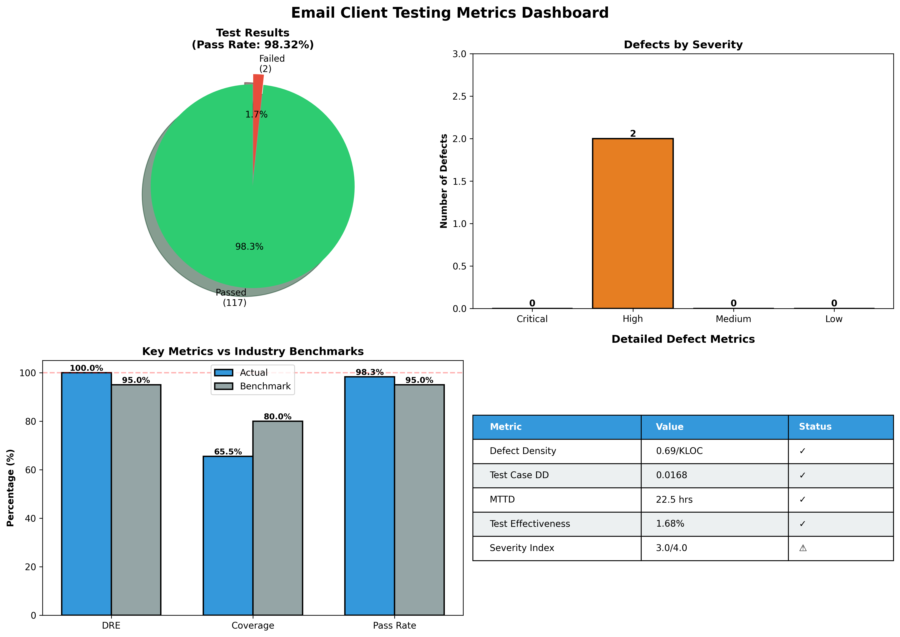

# 📧 SMTP-SERVER: Email Client with Storage & Management

A desktop **email client** written in **Python** that talks to mail servers directly over **SMTP** (sending) and **IMAP** (receiving), stores every sent and received email in a **MySQL** database, and wraps it all in a **Tkinter** GUI.

It was built for a Computer Networks course to understand email protocols at a fundamental level, and was later covered by an automated **`unittest`** suite for a Software Testing course (**119 test cases, 98.32% pass rate**).

---

## Table of Contents

- [Features](#features)
- [Architecture](#architecture)
- [Database Schema](#database-schema)
- [Tech Stack](#tech-stack)
- [Getting Started](#getting-started)
- [Testing](#testing)
- [Project Structure](#project-structure)
- [Supported Providers](#supported-providers)
- [Security Notes](#security-notes)
- [Known Issues](#known-issues)
- [Documentation](#documentation)
- [Authors](#authors)
- [License](#license)

---

## Features

**Sending (SMTP)**
- Compose and send plain-text or HTML emails to multiple recipients
- Attach files, with an attachment list you can add to, remove from, and clear
- Attachment size limit and MIME-type detection
- **Code snippet sender:** pick from 17 languages, load code straight from a file, and send it as formatted HTML, as an attachment, or both. Built-in syntax highlighting (keywords and strings) covers Python, JavaScript/TypeScript, and HTML/XML

**Receiving (IMAP)**
- Secure retrieval over **IMAP4-SSL**
- Fetches unread messages from the inbox
- **Smart attachment handling:** filename decoding for international characters, filename sanitising against path traversal, duplicate-file handling, and a separate folder per email under `Downloads/Email_Attachments`
- Detects code content in messages and saves it to files with the right extension

**Storage & management**
- Every sent and received email is saved to **MySQL**: metadata (sender, recipients, subject, date) kept apart from content (body, HTML, attachments)
- Email history viewer with filtering by **sent / received**, plus a detail view and attachment opening
- Persistent across sessions

**Email interaction**
- Reply, forward, print, and save an email as a text file

**Responsive UI**
- Logging in, sending, and receiving run on background threads, with results handed back to the GUI through a **producer-consumer queue**, so the window never freezes

---

## Architecture

A **layered client-server design** with a producer-consumer threading model:

| Layer | Responsibility |
|---|---|
| **GUI** (`main.py`) | Tkinter interface: login, compose, inbox, history, code snippets |
| **Backend services** | `send_mail.py` (SMTP) and `recieve.py` (IMAP) |
| **Database layer** | `DatabaseManager` in `db_manager.py` wraps all MySQL operations |
| **File system** | Organised attachment storage |
| **Network** | STARTTLS for SMTP and SSL for IMAP |

---

## Database Schema

Four related tables with foreign keys, created automatically on startup:

| Table | Stores |
|---|---|
| `users` | Email account, display name, provider, last login |
| `emails` | Subject, sender, recipients, date, plain and HTML body, sent/received flag, linked to a user |
| `recipients` | Each recipient of an email, with a type column (`to` / `cc` / `bcc`) |
| `attachments` | Filename, path, type, size, and a code-file flag, linked to an email |

---

## Tech Stack

- **Language:** Python 3.8+
- **Protocols:** SMTP (`smtplib`), IMAP4-SSL (`imaplib`), `email`, `ssl`, `mimetypes`
- **Database:** MySQL 8.0+ via `mysql-connector-python`
- **GUI:** Tkinter
- **Concurrency:** `threading` and `queue`
- **Config:** `python-dotenv`
- **Testing:** `unittest` (plus `matplotlib` and `numpy` for the metrics chart)

---

## Getting Started

### Prerequisites
- Python 3.8 or newer (with Tkinter, which is included in the standard Windows and macOS installers)
- A running MySQL 8.0+ server
- An **app password** for your Gmail account (see [Security Notes](#security-notes))

### 1. Clone and install

```bash
git clone https://github.com/Talha-Munir-Saeed3/SMTP-SERVER.git
cd SMTP-SERVER
python -m venv venv
venv\Scripts\activate          # macOS/Linux: source venv/bin/activate
pip install -r requirements.txt
```

### 2. Create the database
Create an empty MySQL database for the app, using `cn.sql` or:

```sql
CREATE DATABASE email_client;
```

You don't need to create the tables yourself: the app creates the four tables the first time it starts.

### 3. Configure environment variables
Copy the template and fill in your own values:

```bash
cp .env.example .env           # Windows: copy .env.example .env
```

| Variable | Purpose | Default |
|---|---|---|
| `DB_HOST` | MySQL host | `localhost` |
| `DB_USERNAME` | MySQL user | `root` |
| `DB_PASSWORD` | MySQL password | *(empty)* |
| `DB_NAME` | Database name | `email_client` |
| `GMAIL_USERNAME` | Pre-fills the login screen (optional) | |
| `GMAIL_APP_PASSWORD` | Pre-fills the login screen (optional) | |

**Never commit `.env`.** It is already listed in `.gitignore`.

### 4. Run

```bash
python main.py
```

Choose your provider, enter your email address and app password, and start sending and receiving.

---

## Testing

The suite uses Python's built-in **`unittest`** framework and lives in [`Testing/`](Testing). It contains **119 test cases in 15 categories**: email validation, database operations, sending, receiving, attachments, integration, security, performance, content types, date/time, edge cases, GUI features, real-world validation, advanced validation, and print functionality.

```bash
python Testing/testcases.py          # runs the suite and writes Testing/report.txt
cd Testing
python testingmetrics.py             # builds metrics JSON and chart from report.txt
```

> The suite needs your `.env` configured and a reachable MySQL server, and the GUI tests need a desktop environment for Tkinter. The metrics script needs `pip install matplotlib numpy` for the chart.

**Results**

| Metric | Value |
|---|---|
| Total test cases | 119 |
| Passed | 117 |
| Failed | 2 |
| Pass rate | **98.32%** |

Security tests (SQL injection, XSS, path traversal) all pass.



**Why not Selenium?** Selenium was the original plan, but it targets web browsers and cannot see native Tkinter widgets, so the project moved to `unittest` for backend logic and GUI features.

| File | Purpose |
|---|---|
| `testcases.py` | The test cases and the report generator |
| `testingmetrics.py` | Reads `report.txt` and produces metrics and a chart |
| `testing_metrics.json` | Raw metrics output |
| `testing_metrics_chart.png` | Metrics chart |
| `report.txt` | Detailed text test report |

---

## Project Structure

```
SMTP-SERVER/
├── main.py              # Tkinter GUI and application entry point
├── send_mail.py         # SMTP sending, MIME building, code highlighting
├── recieve.py           # IMAP receiving and attachment handling
├── db_manager.py        # DatabaseManager (all MySQL operations)
├── cn.sql               # Database setup script
├── requirements.txt     # Python dependencies
├── .env.example         # Template for environment variables
├── .gitignore
├── LICENSE
├── Testing/             # unittest suite, metrics and reports
└── Documents/           # Project and testing reports
```

---

## Supported Providers

| Provider | Login & receiving | Sending |
|---|---|---|
| **Gmail** | ✅ Fully tested | ✅ Fully tested |
| **Yahoo** | ⚠️ Configured, not verified in our region | ⚠️ See [Known Issues](#known-issues) |
| **Outlook / Hotmail** | ⚠️ Configured, app-password login not verified | ⚠️ See [Known Issues](#known-issues) |

---

## Security Notes

- Most providers require an **app password** instead of your normal password, and an app password requires **2-factor authentication** on the account.
- Credentials are read from `.env`, never hard-coded in the repository.
- Attachment filenames are sanitised to block path traversal, and the test suite checks for SQL injection and XSS.
- Treat app passwords like real passwords: if one is ever exposed, revoke it and create a new one.

---

## Known Issues

- **Sending is Gmail-only.** The login check and IMAP receiving use the provider you select, but `send_mail.py` connects to `smtp.gmail.com:587` directly, so Yahoo and Outlook accounts cannot send yet. The fix is to pass the selected provider's SMTP host and port into `send_mail()`.
- **Two failing tests in email validation.** Addresses starting with a **dot** (`.user@example.com`) or a **hyphen** (`-user@example.com`) are accepted by the validation regex, though they should be rejected under RFC 5322. In practice the mail server handles both (Gmail treats the dot version as the sender's own address, and rejects the hyphen version with a delivery failure notice). Tightening the regex would fix both.
- **Opening attachments from the history view is Windows-only**, because it uses `os.startfile`.
- **Recipients are all stored as type `to`**, although the schema supports `cc` and `bcc`.

---

## Documentation

Full project reports are in the [`Documents/`](Documents) folder:

- **Computer Networks Project Report:** motivation, scope, planning, feasibility, architecture, ER diagram, and workflow
- **Software Testing Project Report:** testing strategy, all test cases, results, and metrics

---

## Authors

*Talha Munir Saeed* 

---

## License

This project is licensed under the terms of the [LICENSE](LICENSE) file.
